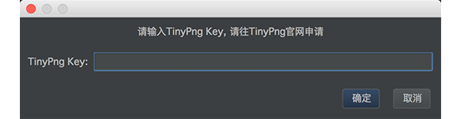
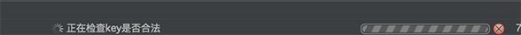
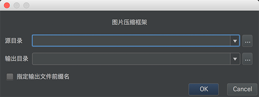
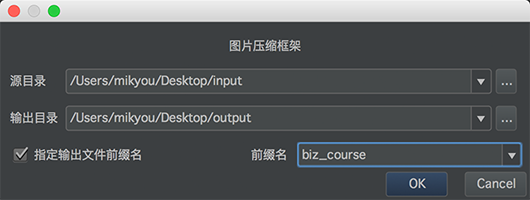
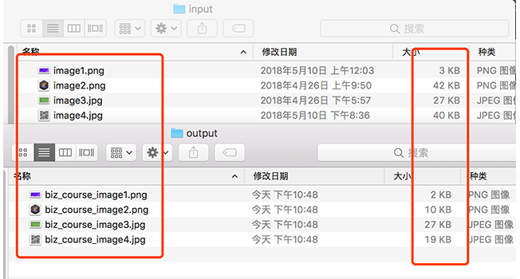
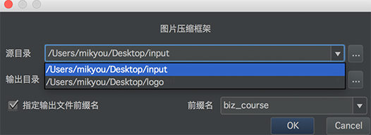

# ImageSlimming

## 使用导学

### 一、简述

ImageSlimming是一个基于TinyPng API开发的图片压缩的IDEA工具插件，采用的是Kotlin语言开发以及Java Swing框架设计UI界面。可运行在AndroidStudio,Intellij IDEA,WebStorm等一系列的JetBrains全家桶中。
现在大家可以在JetBrains Plugins Repository中搜索"ImageSlimming"就可以安装了。

### 二、支持的功能

* 1、支持整个目录中的图片批量压缩，只需要指定图片源目录和压缩的输出目录即可
* 2、支持单张或者选定多张图片文件进行压缩
* 3、支持png,jpg格式图片
* 4、支持输入目录和输出目录二次选择功能，减少繁琐指定相同的目录
* 5、支持指定输入文件的前缀，也即是批量文件添加前缀名，以及前缀名二次选择功能
* 6、图片压缩过程中，仍然继续coding, 工作并行执行
* 7、支持在IDE中任意工作目录下选中一张或者多张png,jpg，右键选择"Quick Slim Images",即可实现图片压缩非常方便

### 三、开发中用到的技术点

* 1、Intellij Idea 插件开发基础知识
* 2、插件开发中如何执行一个后台线程任务Task.Backgroundable的使用
* 3、Intellij Idea open api 的使用
* 4、Kotlin 开发基础知识
* 5、Kotlin中扩展函数的封装，Lambda表达式，函数式API，IO流API的使用。
* 6、Java中Swing UI框架的基本使用
* 7、TinyPng API基本使用

### 四、开发教程

[用Kotlin撸一个图片压缩插件ImageSlimming系列文章](https://juejin.im/post/5b3453fe6fb9a00e883f37fa)

### 四、使用步骤

* 1、首先，按照Plugin通用安装方式，安装好对应的插件，可以直接在jetbrains仓库中搜索ImageSlimming,安装重启即可。
重启后发现有如图插件，就说明安装成功。

* 2、然后点击插件，第一次需要你填入TinyPng APIKEY,由于插件图片压缩主要借助于TinyPng Api, 所以需要使用者去TinyPng官网申请 [https://tinypng.com/developers](https://tinypng.com/developers)

* 3、输入申请到ApiKey后，插件会自动验证KEY的合法性，检测通过后会弹出压缩图片界面

* 4、选择源目录也就是原图片目录，输出目录也就是压缩后图片存放目录，当然也可以指定特定某张或某些图片文件作为输入源，

* 5、是否指定输出文件前缀名，该功能主要适用于在Android中多模块开发的时候，每个模块图片资源名不能重复，所以每个模块图片前缀不一样，这里可以指定输出文件前缀。

* 6、点击OK就开始压缩了，此时压缩过程你可以继续你的coding,最后压缩完毕会以对话框提示。

* 7、压缩结果

* 8、为了减少指定输入输出目录次数以及文件前缀的次数，会把每次用户使用过的目录给缓存起来，以及下次直接选择使用，也就是前面说的二次选择功能。

### 五、版本release note

#### V1.0

* 插件基本功能

#### V1.1

* 加入了指定文件前缀名功能

#### V1.2

* 加入选中IDE工作去任意目录下图片文件，右键选择"Quick Slim Images",即可实现图片压缩

如此方便，赶快去下载试试吧，如果您觉得不错，欢迎给个star哦！

